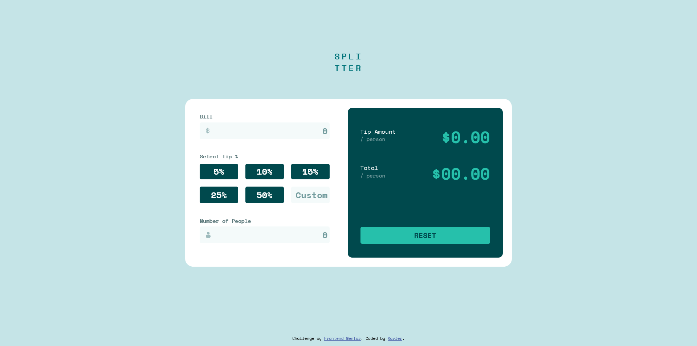

# Frontend Mentor - Order summary card solution

This is a solution to the [Order summary card challenge on Frontend Mentor](https://www.frontendmentor.io/challenges/order-summary-component-QlPmajDUj). Frontend Mentor challenges help you improve your coding skills by building realistic projects. 

## Table of contents

- [Overview](#overview)
  - [The challenge](#the-challenge)
  - [Screenshot](#screenshot)
  - [Links](#links)
- [My process](#my-process)
  - [Built with](#built-with)
  - [What I learned](#what-i-learned)
  - [Continued development](#continued-development)
  - [Useful resources](#useful-resources)
- [Author](#author)

## Overview

### The challenge

Users should be able to:

- See hover states for interactive elements

### Screenshot



### Links

- Live Site URL: [DEMO LIVE](https://xavier192.github.io/tip-calculator-challange/)

## My process

### Built with

- Semantic HTML5 markup
- CSS custom properties
- Flexbox
- CSS Grid
- Mobile-first workflow
- Jvascript scope correct usage.

### What I learned
- Javascript module pattern.

```js
const splitterData = function () {
    const inputData = [0, 0, 0];
    const inputConstraints = [999999, 150, 10000];

    function getInputData() { return inputData }
    function getInputConstraints() { return inputConstraints }
    function setInputData(index, data) { inputData[index] = data }
    function setInputConstraint(index, data) { inputConstraints[index] = data }

    return {
        getInputData: getInputData,
        getInputConstraints: getInputConstraints,
        setInputData: setInputData,
        setInputConstraint: setInputConstraint
    }
}();
```

### Continued development

I wish to learn more about javascript and advanced css.

### Useful resources

- [W3 javascript good practices](https://www.w3.org/wiki/JavaScript_best_practices) - Helped me a lot refactoring my code.

## Author

- Frontend Mentor - [@Xavier](https://www.frontendmentor.io/profile/Xavier192)

